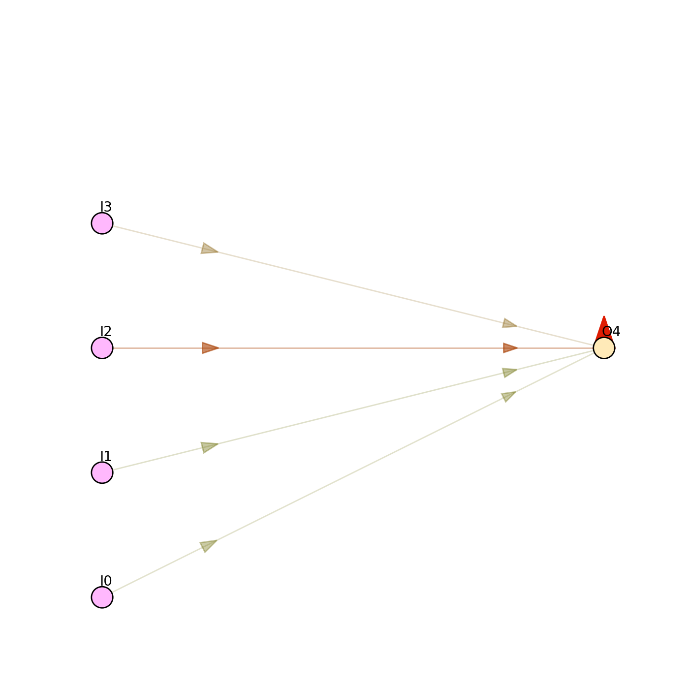

# [Cart-Pole Balancing problem](https://pdfs.semanticscholar.org/a5b9/dc45d2eaf5a3336aa070cafdf4cce2deefbc.pdf) with Neural Nets and GA

In this project I tried to solve the Cart-Pole Balancing problem with Neural Networks optimized with Genetic Algorithms.

First, the problem was solved with Physic inputs (4-input model):
  1. sin() of the pole's angle;
  2. the pole's angular velocity;
  3. the cart's velocity;
  4. the cart distance from the center;

The output is [-1; 1] and it determines how much force to apply to the cart each *Physics Frame* or Unity's *Fixed Update*. The value is multiplied with [fixedDeltaTime](https://docs.unity3d.com/ScriptReference/Time-fixedDeltaTime.html).

**The fitness:**
  If the agent is below a certain angle, it receives no fitness. If it's inside the desired threshold, the time is remembered so that the fitness is `Math.Pow(t, 1.5)`. Meaning: the longer you stay up, the exponentially more fitness you get. Also, while it's in the desired threshold, it receives a small reward for depending on how far it is from the center.

**Note:** to keep the inputs normalized, the second and the third inputs are divided by a number that's a bit higher than the average angular velocity and respectively, cart's velocity. There are better ways to normalize these 2 inputs.

The minimal solution for the 4-input model would be to have no extra neurons than inputs and outputs. The algorithm did converge to a solution for this minimal model, but I added an extra recursive connection from output to output. With the extra memory, it started to find a solution with about 3-6 generations faster than usual.

To make things more interesting, I apply a random force every **n** seconds. To make the agents learn faster, I use a *Curriculum Learning technique* (at least I believe I do). The idea is to start from something very easy and continuously increase the difficulty. So, I have 8 states. In the first state of the curriculum, the agents start vertically and the random force is barely felt. The next 5 states the force is increased until it becomes quite ridiculous. At state 7 and 8, the agents start upside down, so that they can learn to swing up. Also, in state 1-6, the agents are disqualified if they get below a certain level (with no penalties).

Initially I tried to start the agents upside down, but they didn't converge (at least until generation 50).

Then I made them start vertically up. In this case, they did start to learn, but it was still pretty slow. Then I started to disqualify those who are below the desired threshold. This led to a very fast learning rate.

Combined with the *Curriculum Learning*, the agents learn in time to swing up.

## Results 4-input model:
The population finishes the task if they get at least one agent to swing up and withstand about 100 seconds of ridiculous random force.

  * about 16 generations with the RNN output-output;
  * about 3-4 more generations without the RNN;

## The 2-input model
This model represents a neural network with only 2 inputs and, very importantly, at least 1 RNN. The minimal solution is composed of only 3 neurons and 3 connections (synapses).

The inputs are the same as above, without the physical ones.
Because the first input is sin() of the angle, it can't possibly be as good as the 4-input model. I believe there's a better way to provide the angle input to the system. With that being said, the 2-input model does learn to balance, but it can't handle big random forces, so it stops at the stage 4/8 in the curriculum in about 18-20 generations.
